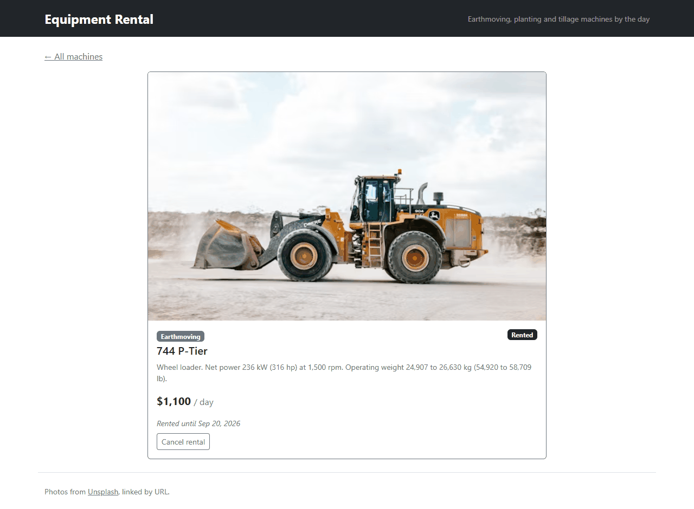
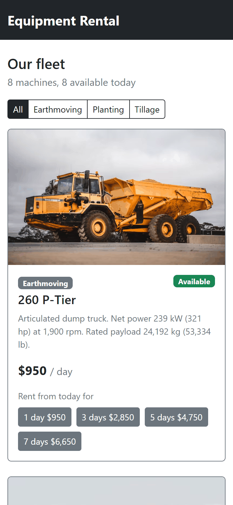

# equipment-rental

[](https://github.com/Arthure-code/equipment-rental/actions/workflows/build.yml)
[](https://sonarcloud.io/summary/new_code?id=Arthure-code_equipment-rental)
[](https://sonarcloud.io/summary/new_code?id=Arthure-code_equipment-rental)
[](https://sonarcloud.io/summary/new_code?id=Arthure-code_equipment-rental)
[](https://sonarcloud.io/summary/new_code?id=Arthure-code_equipment-rental)
[](https://sonarcloud.io/summary/new_code?id=Arthure-code_equipment-rental)
[](https://sonarcloud.io/summary/new_code?id=Arthure-code_equipment-rental)
[](https://sonarcloud.io/summary/new_code?id=Arthure-code_equipment-rental)

Which machines can go out today, for how long, and at what price? A
rental counter for heavy equipment: eight machines, earthmoving,
planting and tillage, each with its photo, its specifications and its
daily rate. A machine that is free can be rented from today for one,
three, five or seven days, priced on the button; a machine that is out
says until when, and the rental can be cancelled. The API refuses to rent
a machine twice, and the catalogue reads its availability from the
rentals themselves.

Two projects in one repository: `api`, an ASP.NET Core 8 Web API with
Entity Framework Core on SQLite, and `web`, an Angular 21 application
with Bootstrap.

## Screenshots






## How it works

**Availability is computed, not stored.** A machine has rentals; it is
available when no active rental covers this moment. `EquipmentService`
projects that in one query, `RentedFrom` and `RentedUntil` included, so
the catalogue and a machine's page never disagree with the rentals
table. Cancelling clears the rental's flag rather than deleting it, and
the history stays.

**Renting is refused before it is written.** `RentalService` looks for
an active rental that overlaps the requested days and answers
`AlreadyRented`; the controller turns that into 409, an unknown machine
into 404, and `[Range(1, 30)]` on the request turns a bad number of days
into 400 before the service runs. A success is 201 with the priced
rental and a `Location` header to the machine.

**The fleet ships with the code.** `Fleet.cs` seeds the eight machines
through `HasData`; `EnsureCreated` builds `rental.db` on first start, so
a clone runs with nothing to import. The pictures are public photos on
Unsplash, linked by URL: the API keeps the bare address and the card
asks Unsplash for the width it needs.

**Dates travel in UTC.** The rental dates are written in UTC and read
back with a converter that restores the UTC kind, so the JSON carries
its `Z` and the browser converts once, to the visitor's time.

**One card, two pages.** `EquipmentCard` shows a machine and emits
`rent` or `cancelRental`; the list and the detail page both use it and
call the service. The list filters by category with buttons built from
the categories found, counts what is available, and disables the card
being changed while its request is in flight. The detail page reads the
id from the address through `withComponentInputBinding`.

**Drawn before the answer.** Six empty cards with the same frame as the
real ones hold the page while the fleet loads, and every photo declares
its size, so nothing moves when the API answers or when a picture
arrives.

## Running it

The API, from `api/EquipmentRental.Api`:

```bash
dotnet run --launch-profile http
```

It listens on `http://localhost:5078`, creates `rental.db` with the
fleet on first start and serves Swagger at `/swagger`. The web app,
from `web`:

```bash
npm install
npm start
```

Open `http://localhost:4200/`. The API accepts the browser from
`http://localhost:4200` (and from any local origin while developing);
`API_URL` in `equipment.service.ts` is the one line to change for a
hosted API.

## Tests

From `api`:

```bash
dotnet test
```

Eleven xUnit tests through HTTP on the real pipeline, the database
swapped for SQLite in memory: the seeded fleet, availability and dates,
201 with the price, 409 on a second rental, 400 outside 1 to 30 days,
204 then 404 on cancel, renting again after a cancel, 404 for an unknown
machine, and the CORS header.

From `web`:

```bash
npm test
```

Sixteen Vitest tests through `TestBed`, as the Angular guides show: the
service against `HttpTestingController`, the card with its inputs set
and its outputs listened to, the list and the detail page with the
service replaced by a stub. `npm run lint` runs angular-eslint on the
TypeScript and the templates, `npm run coverage` writes the lcov report
that the workflow, with the OpenCover report of `dotnet test`, hands to
SonarCloud.

## Stack

ASP.NET Core 8 Web API, Entity Framework Core 8 with SQLite, xUnit with
`WebApplicationFactory`. Angular 21 with standalone components, signals,
`input()` and `output()`, Vitest; Bootstrap 5.3 through npm, only the
parts the pages use.

## Résumé

Un comptoir de location de machinerie lourde : huit machines, terrassement,
semis et travail du sol, chacune avec sa photo, ses caractéristiques et
son tarif à la journée. Une machine libre se loue à partir d'aujourd'hui
pour un, trois, cinq ou sept jours, le prix sur le bouton ; une machine
sortie dit jusqu'à quand, et la location s'annule. La disponibilité est
calculée à partir des locations elles-mêmes, jamais stockée à part ;
l'API refuse de louer deux fois la même machine (409), répond 404 à un
numéro inconnu et 400 à une durée hors de 1 à 30 jours. La flotte est
créée avec le code au premier démarrage, les photos sont des images
publiques Unsplash liées par adresse. ASP.NET Core 8 et EF Core sur
SQLite d'un côté, Angular 21 avec signaux et Bootstrap de l'autre ; onze
tests xUnit et seize tests Vitest.

## Licence

MIT. See [LICENSE](LICENSE). The photos are public pictures on
[Unsplash](https://unsplash.com/license), linked by URL.
